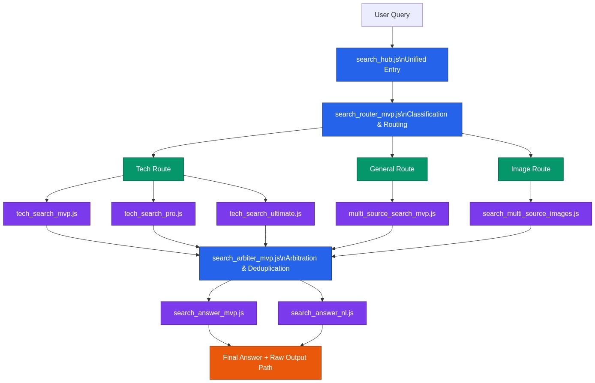

# Search Middle Platform

A multi-source search skill for routing, aggregation, arbitration, and answer synthesis.

`search-middle-platform` is designed for agent workflows that need more than a single quick search call. It provides a compact pipeline for classifying queries, selecting search routes, aggregating results, de-duplicating noisy outputs, and producing a tighter final answer.

## Overview

This repository packages the search middle platform as an installable skill and includes the scripts that power its current beta workflow.

## Architecture Diagram

It is best suited for:
- technical troubleshooting and debugging research
- general web search with multi-source aggregation
- image-oriented search flows
- answer-oriented search pipelines that benefit from arbitration

## Repository Layout

- `search-middle-platform/` — installable skill folder
- `search-middle-platform/SKILL.md` — primary skill definition
- `search-middle-platform/scripts/` — executable search pipeline scripts
- `search-middle-platform/references/` — supporting documentation and historical notes
- `search-middle-platform.skill` — packaged distributable skill file

## Current Pipeline Shape

The current implementation follows a hub → route → search → arbitrate → answer shape.

Main components:
- `scripts/search_hub.js` — unified entry point
- `scripts/search_router_mvp.js` — route selection
- `scripts/multi_source_search_mvp.js` — general multi-source search
- `scripts/tech_search_mvp.js` — baseline technical search
- `scripts/tech_search_pro.js` — stronger technical search path
- `scripts/tech_search_ultimate.js` — expanded technical search path
- `scripts/search_multi_source_images.js` — image aggregation search
- `scripts/search_arbiter_mvp.js` — basic result arbitration
- `scripts/search_answer_mvp.js` — final answer synthesis
- `scripts/search_answer_nl.js` — natural-language answer rendering

## Supported Routes

- `tech`
- `general`
- `image`

## Quick Start

Run the unified entry script:

`node search-middle-platform/scripts/search_hub.js "OpenClaw browser timeout" output/search_hub`

Or from inside the skill folder:

`node scripts/search_hub.js "OpenClaw browser timeout" output/search_hub`

## What the Skill Does

Given one query, the current system can:
- classify the query type
- choose a suitable search route
- run the relevant search flow
- normalize and de-duplicate raw outputs
- perform lightweight arbitration
- generate a tighter final answer

## Installation

### Option 1: Use the skill folder

Copy `search-middle-platform/` into your agent's skills directory and load it via your normal skills workflow.

### Option 2: Import the packaged skill

Use the bundled file:
- `search-middle-platform.skill`

Import it into an environment that supports AgentSkills.

## Design Goals

This project aims to keep the external interface simple while allowing the internal search stack to grow.

Target qualities:
- one entry point
- explicit route selection
- reusable source pipelines
- visible arbitration stage
- answer synthesis as a separate layer

## Current Status

This is a beta repository.

What is already true:
- the overall skeleton is in place
- three base scenarios have been validated
- the skill is usable for real experimentation

What still needs work:
- stronger arbitration quality
- tighter classification logic
- more consistent output schemas across routes
- better automated tests
- better source abstraction and shared utilities

## Documentation

- 中文文档入口：`docs/README.zh-CN.md`
- 架构说明：`docs/architecture.md`
- 流程图说明：`docs/flowchart.md`
- Mermaid 源文件：`docs/flowchart.mmd`
- 架构图 Mermaid：`docs/architecture-diagram.mmd`
- 架构图 PNG：`docs/architecture-diagram.png`
- Roadmap：`docs/ROADMAP.md`
- TODO：`docs/TODO.md`
- Milestones：`docs/MILESTONES.md`

## Related Repository

This skill is referenced by the team-mode operating model here:
- `https://github.com/jasperliu2026ai/team-mode-skill`

## Customization Ideas

Common next steps for teams adopting this repository:
- add more data sources behind the router layer
- define a stable output schema for all routes
- add confidence scores and ranking logic
- improve answer synthesis prompts and post-processing
- add minimal regression tests for the key scripts

## License

MIT
