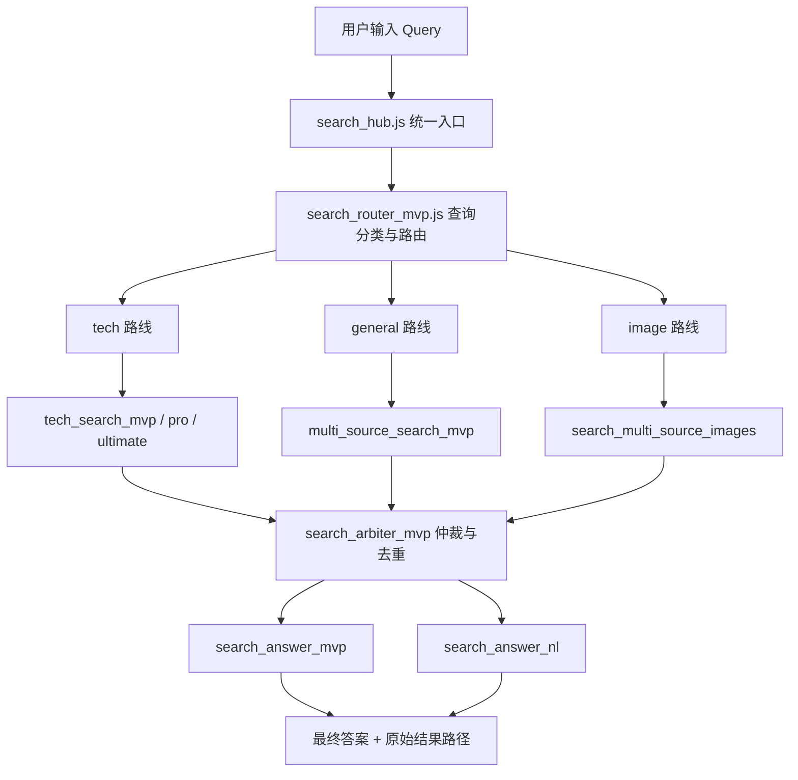

# Search Middle Platform 中文说明

`search-middle-platform` 是一套给 Agent 用的多源搜索中台 Skill。

它的目标不是“再包一层搜索”，而是把一条搜索链路标准化：
- 先判断问题类型
- 再决定走哪条搜索路线
- 再聚合多源结果
- 再做去重和基础仲裁
- 最后产出更收敛的答案

## 它解决什么问题

很多 Agent 的搜索流程都有这几个老毛病：
- 查什么都走一个源，结果偏
- 技术问题、通用问题、图片问题混着搜，路线不分
- 搜到了很多结果，但没有仲裁层，最后答案很散
- 脚本各写各的，入口不统一，后面维护地狱

`search-middle-platform` 的意义就在这：
- 给搜索能力做一个统一入口
- 让不同问题走不同路线
- 让“搜索”变成一个可扩展、可演进的中台层

## 当前能力边界

当前支持三类基础路线：
- `tech`：技术问题搜索
- `general`：通用网页搜索
- `image`：图片聚合搜索

它目前还是 Beta，不要吹过头。
已经能用，但还不是最终形态。

## 流程图

上面这张图对应的是当前版本最核心的一条搜索链路：
- `search_hub.js` 负责统一入口
- `search_router_mvp.js` 负责分类和路由
- 三条搜索路线分别处理不同类型问题
- `search_arbiter_mvp.js` 负责基础仲裁与去重
- `search_answer_*` 负责答案收敛和输出包装

## 当前结构

### 统一入口

- `scripts/search_hub.js`

负责接收查询，并驱动后续流程。

### 路由层

- `scripts/search_router_mvp.js`

负责把查询分发到：
- 技术路线
- 通用路线
- 图片路线

### 搜索执行层

- `scripts/multi_source_search_mvp.js`
- `scripts/tech_search_mvp.js`
- `scripts/tech_search_pro.js`
- `scripts/tech_search_ultimate.js`
- `scripts/search_multi_source_images.js`

负责不同类型问题的实际搜索。

### 仲裁层

- `scripts/search_arbiter_mvp.js`

负责基础去重、筛选、仲裁。

### 答案收敛层

- `scripts/search_answer_mvp.js`
- `scripts/search_answer_nl.js`

负责把原始搜索结果加工成更适合直接给用户的最终答案。

## 推荐工作流

推荐按下面这条链路理解它：

1. 输入一个查询
2. 判断查询属于 `tech` / `general` / `image`
3. 路由到对应搜索脚本
4. 聚合原始结果
5. 做基础仲裁与去重
6. 输出最终答案和原始结果路径

## 运行方式

### 从仓库根目录运行

`node search-middle-platform/scripts/search_hub.js "OpenClaw browser timeout" output/search_hub`

### 从 skill 目录运行

`node scripts/search_hub.js "OpenClaw browser timeout" output/search_hub`

## 适合接入的场景

- 给 Agent 提供统一搜索入口
- 需要技术问题优先走技术路线
- 需要多源聚合，而不是单源查询
- 需要把搜索结果再做一层答案收敛
- 想把搜索能力做成可扩展模块，而不是一堆零散脚本

## 现在还不够好的地方

当前还可以继续补：
- 更稳定的分类逻辑
- 更强的仲裁评分机制
- 三条路线统一输出 schema
- 更清晰的 source adapter 抽象
- 自动化测试
- 更好的错误观测与日志

## 和 team-mode-skill 的关系

这个仓库是 `team-mode-skill` 的配套搜索能力之一。
在团队模式下，涉及：
- 技术检索
- 多源搜索
- 图片聚合
- 答案收敛

优先推荐挂这套 `search-middle-platform`。

相关仓库：
- `https://github.com/jasperliu2026ai/team-mode-skill`

## 一句话总结

这不是一个“搜一下”的脚本集合。
这是把 Agent 搜索能力做成中台的一套基础骨架。
