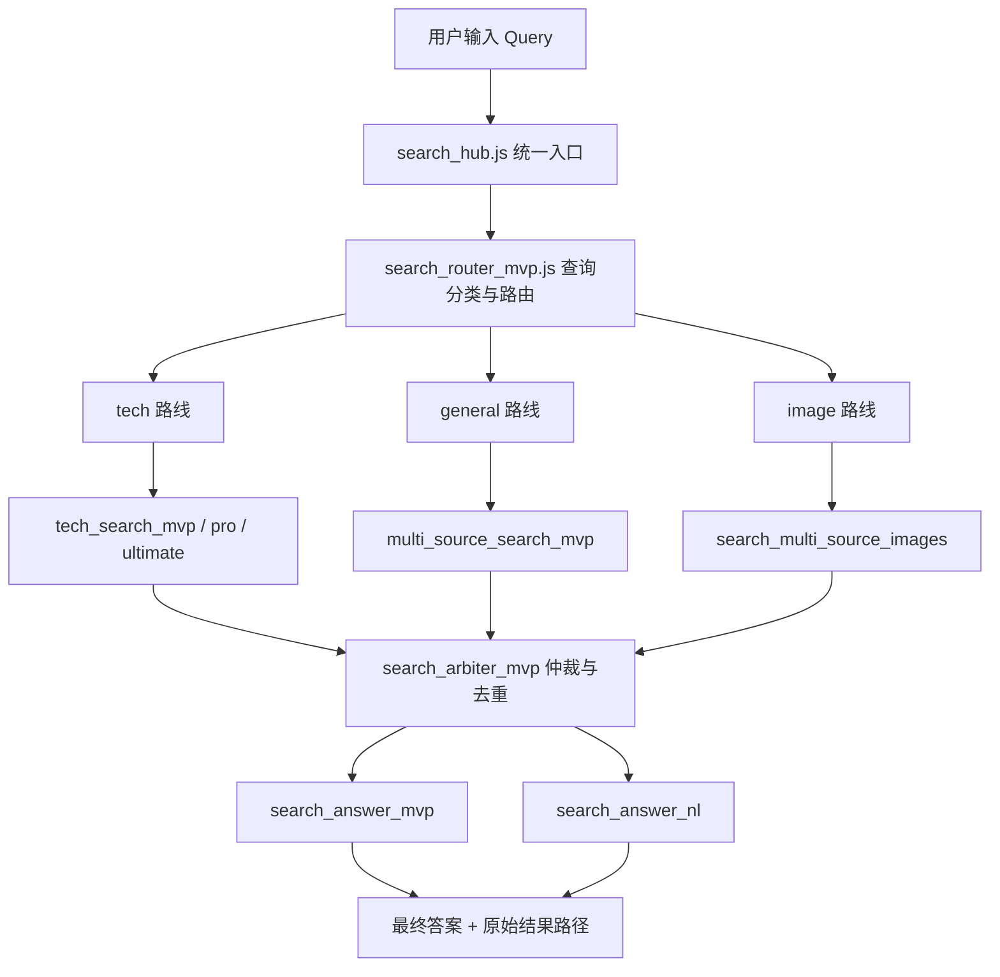

# Search Middle Platform 流程图

## Mermaid

```mermaid
flowchart TD
    A[用户输入 Query] --> B[search_hub.js 统一入口]
    B --> C[search_router_mvp.js 查询分类与路由]
    C --> D1[tech 路线]
    C --> D2[general 路线]
    C --> D3[image 路线]
    D1 --> E1[tech_search_mvp / pro / ultimate]
    D2 --> E2[multi_source_search_mvp]
    D3 --> E3[search_multi_source_images]
    E1 --> F[search_arbiter_mvp 仲裁与去重]
    E2 --> F
    E3 --> F
    F --> G1[search_answer_mvp]
    F --> G2[search_answer_nl]
    G1 --> H[最终答案 + 原始结果路径]
    G2 --> H
```

## 流程解读

- `search_hub.js` 负责统一入口
- `search_router_mvp.js` 负责分类和路由
- 三条搜索路线分别处理不同类型问题
- `search_arbiter_mvp.js` 负责基础仲裁与去重
- `search_answer_*` 负责答案收敛与输出包装
